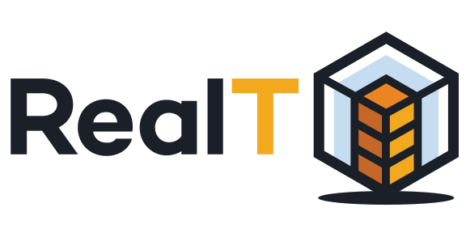

<div id="top"></div>

[![Contributors][contributors-shield]][contributors-url]
[![Forks][forks-shield]][forks-url]
[![Stargazers][stars-shield]][stars-url]
[![Issues][issues-shield]][issues-url]
[![MIT License][license-shield]][license-url]
[![LinkedIn][linkedin-shield]][linkedin-url]

[](https://github.com/real-token/realtoken-yam-interface/actions/workflows/ci-cd.yaml)
[](https://github.com/prettier/prettier)

<!-- PROJECT LOGO -->
<br />
<div align="center" id="about-the-project">
  <!-- <a href="https://github.com/real-token/realtoken-yam-interface">
    
  </a> -->

<h3 align="center">RealToken YAM interface</h3>

  <p align="center">
    Peer-to-peer RealToken YAM Interface
    <br />
    <a href="https://realt.co/"><strong>Realt.co</strong></a>
    <br />
    <br />
    <a href="https://github.com/real-token/realtoken-yam-interface/issues">Report Bug</a>
    ·
    <a href="https://github.com/real-token/realtoken-yam-interface/issues">Request Feature</a>
  </p>
</div>

<!-- TABLE OF CONTENTS -->
<details>
  <summary>Table of Contents</summary>
  <ol>
    <li><a href="#roadmap">Roadmap</a></li>
    <li>
      <a href="#getting-started">Getting Started</a>
      <ul>
        <li><a href="#requirements">Requirements</a></li>
        <li><a href="#installation">Installation</a></li>
      </ul>
    </li>
    <li><a href="#usage">Usage</a></li>
    <li><a href="#contributing">Contributing</a></li>
    <li><a href="#license">License</a></li>
    <li><a href="#contact">Contact</a></li>
    <li><a href="#built-with-hardhat">Built With Hardhat</a></li>
  </ol>
</details>

<!-- ROADMAP -->

# Roadmap

- Replicate interface for each offer type to modify modal ❌

  See the [open issues](https://github.com/real-token/realtoken-yam-interface/issues) for a full list of proposed features (and known issues).

<p align="right">(<a href="#top">back to top</a>)</p>

<!-- GETTING STARTED -->

# Getting Started

## Requirements

### <a name="env">Environement</a>

To run the project you will need to set-up a `.env` file in the root folder:

```
COMMUNITY_API_KEY=XXXXXXXXXXXX
NEXT_PUBLIC_ENV=XX
```

To get a `COMMUNITY_API_KEY`, join the dedicated [telegram dev channel](https://t.me/+XQyoaFfmN61yk7X0) then ask for.

The var `NEXT_PUBLIC_ENV` is used to hide/show some features depending the environement.
Only those values are allowed: `dev`, `staging` or `production`.
The default value is `dev`;

### Node.js version

<strong>📣 Node.js needed version is `v18.12.1`</strong>

## Installation

1. Clone the repo
   ```sh
   git clone https://github.com/real-token/realtoken-yam-interface.git
   ```
2. Install NPM packages
   ```sh
   yarn
   ```
3. Create the env file (instructions [here](#env))
4. Start the application in dev mode
   ```sh
   yarn dev
   ```

<p align="right">(<a href="#top">back to top</a>)</p>

<!-- CONTRIBUTING -->

# Contributing

The community is welcome to participate in the development of the YAM.

## Introduction

All commit's name must follows the [conventional commit](https://www.conventionalcommits.org/en/v1.0.0/) convention.

<strong>⚠️ ALL PR need to be created from `staging` branch and should requested to be merge into `staging` branch. Otherwise PR will be refused.</strong>

## Create a PR (Pull request)

If you have a suggestion that would make this better, please fork the repo and create a pull request. You can also simply open an issue with the tag "enhancement".

Don't forget to give the project a star! Thanks again!

1. Fork the Project
2. Move to `staging` branch (`git checkout staging`)
3. Create your Feature Branch (`git checkout -b feature/AmazingFeature`)
4. Commit your Changes (`git commit -m 'Add some AmazingFeature'`)
5. Push to the Branch (`git push origin feature/AmazingFeature`)
6. Open a Pull Request

## Operation

If you want to improve the YAM there is few things you need to know.

### Technologies stack

#### [Node.js](https://nodejs.org/)

Node.js is a backend technology providing Javascript runtime environment outside server side.

#### [Nextjs](https://nextjs.org/)

Next.js is a framework used to create full-stack modern web application.

#### [React](https://reactjs.org/)

React is used to create dynamic interface.

#### [Typescript](https://www.typescriptlang.org/)

Typescript is a top-layer technology used to typed (add boolean, number etc...) types to javascript. It also significantly reduces errors during development.

#### [Mantine](https://mantine.dev/)

Mantine is the UI development kit we choosed to create the YAM interface.
We choose it because Mantine is under intensive developmenent and is opensource.
It also perfectly match with React, our front-end framework.

#### [web3-react](https://github.com/Uniswap/web3-react)

Web3-react is a typescript/javascript library used to connect YAM to blockchain through different wallet: Injected (Metamask, Frame, etc...), Coinbase, Wallet-connect, etc...

#### [Redux](https://redux.js.org)

Redux is a state manager used to store datas to store data accessible throughout the app.
</br>
See [state management](#state) for more informations.

#### [Jotai](https://jotai.org/)

Jotai is a small state manager.
</br>
See [state management](#state) for more informations.

#### [Eslint](https://eslint.org/) and [Prettier](https://github.com/prettier/prettier)

EsLint and Prettier are too software used to check and clean code, and check for synthax errors into the code.

#### [dotenv](https://www.npmjs.com/package/dotenv)

DotEnv is a library used to read environement variable from `.env` file.

### <a name="state">State management</a>

Two state managers are working together inside YAM app: [Redux](https://redux.js.org/) and [Jotai](https://jotai.org/).
</br>
</br>
Redux stores the most heavy datas (offers, properties,etc...) while Jotai will be used to store datas in cookies and small state that need to be shared between 1-2 components and not the whole application.

You can visualize the redux store with the [redux dev tool](https://chrome.google.com/webstore/detail/redux-devtools/lmhkpmbekcpmknklioeibfkpmmfibljd?hl=en).

### Add a new display

At the moment only two displays are available: Table and Grid. But as a community driven projet you are encouraged to add new ones.
</br>
</br>
If you want to one more you will need:

1. Modify the enum file `src/types/Displays.ts`, to add a new display declaration.
2. Goto `src/components/Display/Display.tsx` file:
3. Add your brand new display in `availableDisplays` Map.
   ````ts
    const availableDisplays = useMemo(() => {
      return new Map<Displays,Display>([
        [Displays.TABLE, {
          display: Displays.TABLE,                // This is the enum key you created before
        title: "Table",                           // This is your display's name
          component: <MarketTable key={"table"}/> // This is your display's component
        }]
      ]);
    },[])```
   ````

Then everything is ready to works !

<p align="right">(<a href="#top">back to top</a>)</p>

<!-- LICENSE -->

# License

Distributed under the MIT License. See `LICENSE.txt` for more information.

<p align="right">(<a href="#top">back to top</a>)</p>

<!-- CONTACT -->

# Contact

- Support - [@RealTPlatform](https://twitter.com/RealTPlatform) - support@realt.co
- Testnet version: [YAM testnet channel](https://t.me/+ENPNiuYajY00ZjQ0)

Project Link: [https://github.com/real-token/realtoken-yam-interface](https://github.com/real-token/realtoken-yam-interface)

<p align="right">(<a href="#top">back to top</a>)</p>

<!-- MARKDOWN LINKS & IMAGES -->

[contributors-shield]: https://img.shields.io/github/contributors/real-token/realtoken-yam-interface.svg?style=for-the-badge
[contributors-url]: https://github.com/real-token/realtoken-yam-interface/graphs/contributors
[forks-shield]: https://img.shields.io/github/forks/real-token/realtoken-yam-interface.svg?style=for-the-badge
[forks-url]: https://github.com/real-token/realtoken-yam-interface/network/members
[stars-shield]: https://img.shields.io/github/stars/real-token/realtoken-yam-interface.svg?style=for-the-badge
[stars-url]: https://github.com/real-token/realtoken-yam-interface/stargazers
[issues-shield]: https://img.shields.io/github/issues/real-token/realtoken-yam-interface.svg?style=for-the-badge
[issues-url]: https://github.com/real-token/realtoken-yam-interface/issues
[license-shield]: https://img.shields.io/github/license/real-token/realtoken-yam-interface.svg?style=for-the-badge
[license-url]: https://github.com/real-token/realtoken-yam-interface/blob/master/LICENSE.txt
[linkedin-shield]: https://img.shields.io/badge/-LinkedIn-black.svg?style=for-the-badge&logo=linkedin&colorB=555
[linkedin-url]: https://www.linkedin.com/company/realtplatform/
[product-screenshot]: images/screenshot.png
[use-template]: images/delete_me.png
[use-url]: https://github.com/real-token/realtoken-yam-interface/generate
